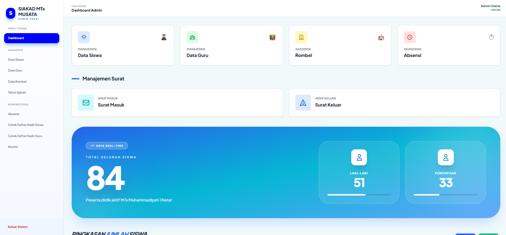
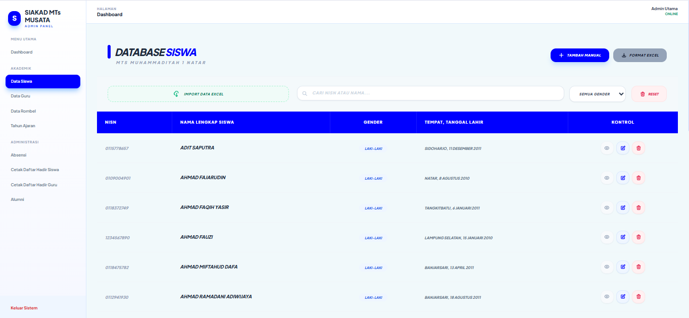
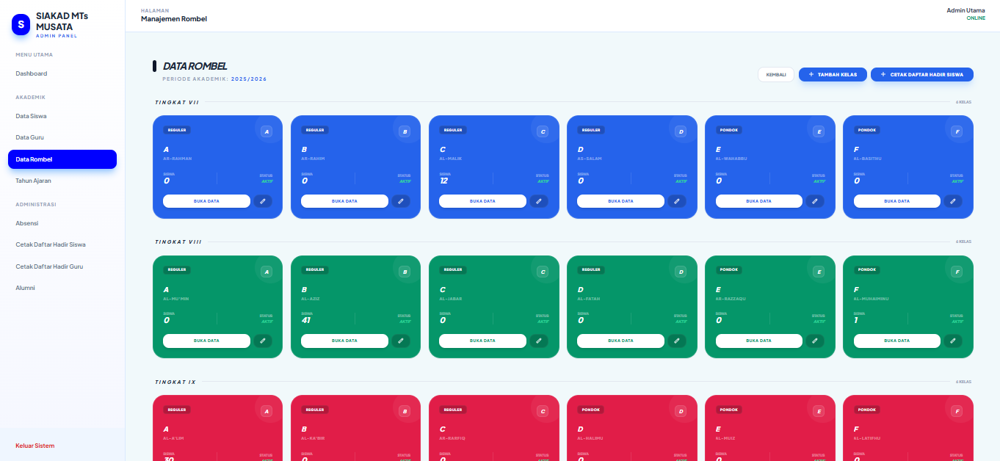
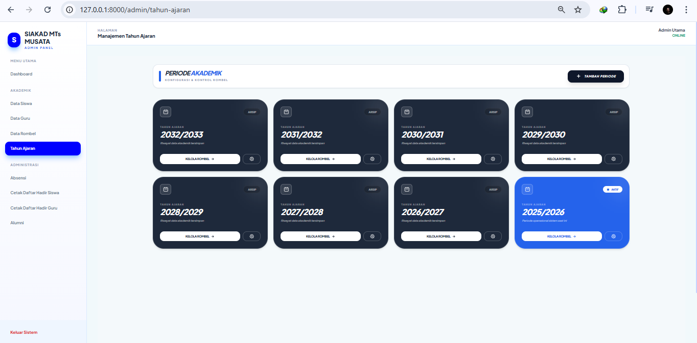
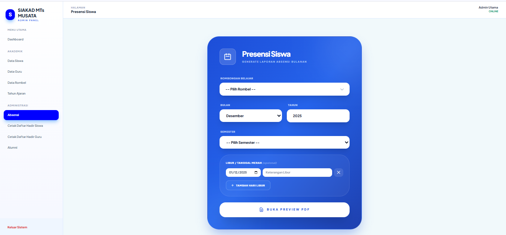

# SIAKAD MTs Mutu Natar

Sistem Informasi Akademik untuk MTs Muhammadiyah 1 Natar, dibangun menggunakan **Laravel 11**.  
Proyek ini mencakup pengelolaan data siswa, guru, kelas, absensi, dan surat masuk/keluar dengan antarmuka admin yang responsif.

---

## 📸 Screenshot

### 1. Dashboard Admin


### 2. Data Siswa


### 3. Data Guru


### 4. Data Kelas


### 5. Absensi Guru


### 6. Surat Masuk & Keluar


---

## ⚙️ Fitur Utama

- **Dashboard Admin**: Menampilkan ringkasan jumlah siswa, guru, dan kelas.  
- **Data Siswa**: CRUD data siswa dengan informasi lengkap (NISN, nama, tanggal lahir, orang tua, dsb).  
- **Data Guru**: CRUD data guru dengan NUPTK, jabatan, pendidikan, dan TMT.  
- **Data Kelas**: Mengelola kelas dan wali kelas.  
- **Absensi Guru**: Pencatatan absensi masuk, izin, alpha, tanpa keterangan, dan rekap bulanan dalam PDF.  
- **Surat Masuk & Keluar**: Upload PDF surat masuk/keluar, tampilkan daftar surat.

---

## 💻 Teknologi

- **Backend**: Laravel 11 (PHP 8.2)  
- **Frontend**: Blade + Tailwind CSS  
- **Database**: MySQL (dikelola menggunakan TablePlus)  
- **Server Lokal**: Laragon (Windows)  

---

## 🚀 Cara Menjalankan Proyek

1. Clone repository:  
```bash
git clone https://github.com/username/siakad-mts-mutu.git
